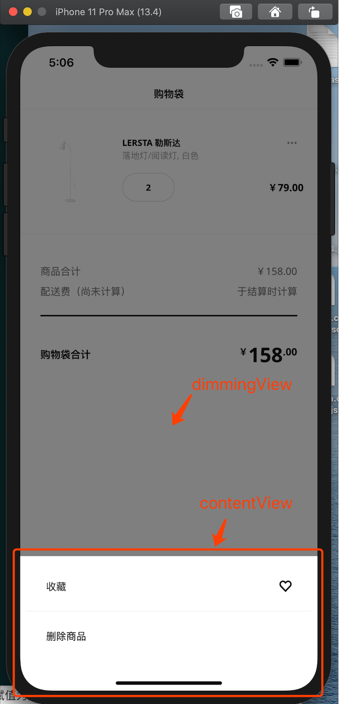

## [DimmingTransition](https://github.com/leiguang/DimmingTransition)
View controller transitioning delegate object with dimming view.


## Support:

- Customize presentation animation
- Customize dismissal animation
- whether allow to dismiss when tap dimming view
- customize operation when tap dimming view


## 介绍

位于文件夹：DimmingTransition

#### 支持：

1. 自定义呈现动画。
2. 自定义消失动画。
3. 是否允许点击暗色背景处消失。
4. 自定义点击暗色背景处的事件。


#### DimmingTransition/Core/ 文件夹包含实现暗色背景转场动画的全部逻辑：


1. `DimmingTransitioning` 是转场动画的代理对象，它会被赋值给 `viewController.transitioningDelegate`
2. `DimmingPresentationAnimatedTransitioning` 负责转场的呈现动画。
3. `DimmingDismissalAnimatedTransitioning` 负责转场的消失动画。
4. `DimmingPresentationController` 是管理两个页面转场动画的容器对象，暗色背景 `dimmingView` 就是添加到了它的 `containerView` 中。


#### 需要实现的代理 `DimmingTransitioningDelegate`：

```swif
protocol DimmingTransitioningDelegate: class {
    var presentationAnimationDuration: TimeInterval { get }
    var dismissalAnimationDuration: TimeInterval { get }
    
    func executePresentationAnimation()
    func executeDismissalAnimation()
    
    var allowTapDimmingViewToDismiss: Bool { get }
    func dimmingViewTapped()
}
```

      1. `presentationAnimationDuration` 呈现动画的时长（Optional，默认=0.25s）。
    
      2. `dismissalAnimationDuration` 消失动画的时长（Optional, 默认=0.25）。
      3. `executePresentationAnimation` 执行呈现动画时调用，在这里实现具体的呈现动画。
      4. `executeDismissalAnimation` 执行消失动画时调用，在这里实现具体的消失动画。
      5. `allowTapDimmingViewToDismiss` 是否允许点击暗色背景来消失页面（Optional，默认=true）。
      6. `dimmingViewTapped` 暗色背景被点击时调用，可在里面实现需要的逻辑，如埋点。





## 使用

对于从底部弹出的通用动画，封装了一个基类 `BottomPresentBaseViewController`，它实现了 `DimmingTransitioningDelegate` 代理，全部代码如下：

```swift
class BottomPresentBaseViewController: UIViewController, DimmingTransitioningDelegate {

    private var dimmingTransitioning: DimmingTransitioning?
    
    override init(nibName nibNameOrNil: String?, bundle nibBundleOrNil: Bundle?) {
        super.init(nibName: nibNameOrNil, bundle: nibBundleOrNil)
        setup()
    }
    
    required init?(coder: NSCoder) {
        super.init(coder: coder)
        setup()
    }
    
    private func setup() {
        dimmingTransitioning = DimmingTransitioning(delegate: self)
        transitioningDelegate = dimmingTransitioning
        modalPresentationStyle = .custom
    }
    
    func executePresentationAnimation() {
        animatedBottomConstraint?.constant = -animatedHeight
        view.layoutIfNeeded()
        UIView.animate(withDuration: 0.25) {
            self.animatedBottomConstraint?.constant = 0
            self.view.layoutIfNeeded()
        }
    }

    func executeDismissalAnimation() {
        UIView.animate(withDuration: 0.25) {
            self.animatedBottomConstraint?.constant = -self.animatedHeight
            self.view.layoutIfNeeded()
        }
    }
    
    // MARK: - Properties or methods to override
    
    /// @Required override
    var animatedBottomConstraint: NSLayoutConstraint? { nil }
    
    /// Optional override
    var animatedHeight: CGFloat { UIScreen.main.bounds.height * 0.8 }
    
    /// Optional override
    var allowTapDimmingViewToDismiss: Bool { true }
    
    /// Optional override
    func dimmingViewTapped() {}
}
```


##### 思路：

假设把从下往上弹出的视图都装进一个 `ContentView` 中，然后对这个 `ContentView` 的底部约束做 y轴位移动画，就可以达到从下往上出现，和从上往下消失的效果。

于是定义一个底部约束属性 `animatedBottomConstraint` ，在 `executePresentationAnimation` 和 `executeDismissalAnimation` 方法中对底部约束做动画。


##### 注意点：

1. 由于 `UIViewController` 的 `transitioningDelegate` 属性是 `weak` 引用，所以，这里必须将 `DimmingTransitioning` 对象设置为全局属性，否则执行完 `setup()` 它就被释放掉了。

2. 子类必须重写 `animatedBottomConstraint` 属性，并将它赋值为真正的 `ContentView` 的底部约束。

3. `animatedHeight` 值的高度（默认等于 屏幕高度 * 0.8，子类可以重写它，但没必要，已可以应付全部高度，看不出动画的明显差别）

    

##### 子类的使用，例如：

```swift
class MoreActionViewController: BottomPresentBaseViewController {
	  // MARK: - Outlets  
  	@IBOutlet weak var contentViewBottomConstraint: NSLayoutConstraint!
  
    // MARK: - Bottom present
    override var animatedBottomConstraint: NSLayoutConstraint? { contentViewBottomConstraint }
  
//    var canOperate = true
	  // Optional override
//    override var allowTapDimmingViewToDismiss: Bool { canOperate }

  	// Optional override
//    func dimmingViewTapped() { print("dimming view tapped") }
}
```


其他 从右往左，从上往下，从中间弹出的动画，也可以写一个这种基类，具体的动画，完全由此基类来实现。


> **Apple Documentation:**
> 
> [Custom View Controller Presentations and Transitions](https://developer.apple.com/library/archive/samplecode/CustomTransitions/Introduction/Intro.html)
> 
> [Apple Official Transitions Demo](https://developer.apple.com/library/content/samplecode/CustomTransitions/CustomViewControllerPresentationsandTransitions.zip)

